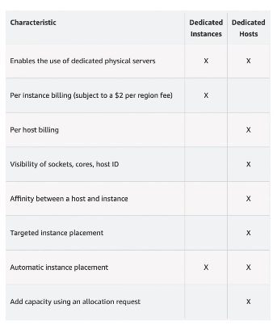

# EC2

- EC2 is one of most popular of AWS's offering.
- EC2 stands for Elastic Compute Cloud = Infrastructure as a service.
- It mainly consists in the capability of:
  - Renting virtual machines (EC2)
  - Storing data on virtual drives (EBS)
  - Distributing load across machines (ELB)
  - Scaling the services using an auto-scaling group (ASG)
- Knowing EC2 is fundamental to understand how the cloud works.

It's no limit that you want to rent a virtual machine on the cloud based on what you need and configure

- Operating System (OS)
- How much compute power & core (CPU)
- How much random-access memory (RAM)
- How much storage space:
  - Network-attached (EBS & EFS)
  - Hardware (EC2 instance store)
- Network card: speed of the card, Public IP address
- Firewall rules: security group
- Bootstrap script (configure at first launch): EC2 User Data

Example: `T2.micro` instance is part of AWS free tier (up to 750 hours per month)

## EC2 user data

- We can use it to bootstrap our instances by EC2 User data script (launching commands when a machine starts).
- It will run once at the instance first start and never re-run again.
- It is used to automate boot tasks such as:
  - Installing updates
  - Installing software
  - Downloading common files from the internet
  - ...

## EC2 instance types

- Detail about EC2 instance located [here](https://aws.amazon.com/ec2/instance-types/).
- AWS has the following naming convention: 

  [instance_class][generation (aws improves them over time)].[size within the instance class] 

  For example: m5.x2large

- Now we have 7 different types for any purposes.

### EC2 instance types - General purpose

- Great for diversity of workloads such as web servers or code repositories
- Balance between:
  - Compute
  - Memory
  - Networking

### EC2 instance types - Compute optimized

- Great for compute-intensive tasks that require high performance processors:
  - Batch processing workloads
  - Media transcoding
  - High performance web servers
  - High performance computing (HPC)
  - Scientific modeling & machine learning
  - Dedicated gaming servers

### EC2 instance types - Memory optimized

- Great for workloads that process large data sets in memory
- Use cases:
  - High performance, relational/non-relational databases.
  - Distributed web scale cache stores.
  - In-memory databases optimized for BI (business intelligence).
  - Applications performing real-time processing of big unstructured data.

### EC2 instance types - Storage optimized

- Great for storage-intensive tasks that require high, sequential read and write access to large data sets on local storage.
- Use cases:
  - High frequency online transaction processing (OLTP) systems.
  - Relational & NoSQL databases.
  - Cache for in-memory databases. (for example: Redis)
  - Data warehousing applications.
  - Distributed file systems.

## EC2 instances purchasing options

- On-demand instances - short workload, predictable pricing, pay by second.
- Reserved (1 & 3 years)
  - Reserved instances - long workloads for example running a database for a long time.
  - Convertible reserved instances - long workloads with flexible instances.
- Saving plans (1 & 3 years) - commitment to an amount of usage, long workload.
- Spot instances - short workloads, cheap, can lose instances (less reliable).
- Dedicated hosts - book an entire physical server, control instance placement.
- Dedicated instances - no others customers will share your hardware.
- Capacity reservations - reserve capacity in a specific AZ for any duration.

### EC2 on demand

- Pay for what you use:
- Linux or Windows - billing per second, after the first minute.
- All other OS - billing per hour.
- Has the highest cost but no upfront payment.
- No long-term commitment.
- Recommended for `short-term` and `un-interupted` workloads, where you can't predict how the application will behave.

### EC2 reserved instances

- Up to 72% discount compared to On-demand.
- Reserve a specific instance attributes (Instance type, region, tenancy, OS)
- Reservation period - 1 Year (+ discount) or 3 Years(+++discount)
- Payment options - No upfront(+), Partial upfront(++), All upfront(+++)
- Reserved instance's scope - Regional or Zonal (reserve capacity in an AZ)
- You can buy and sell in the reserved instance Marketplace if you don't need them anymore.

- Convertible Reserved instance
  - Can change the EC2 instance type, instance family, OS, scope and tenancy.
  - Up to 66% discount compared to On-demand.

### EC2 savings plans

- Get a discount based on long-term usage (up to 72%, same as RIs)
- Commit to a certain type of usage ($10/hour for 1 or 3 years)
- Usage beyond EC2 savings plans is billed at the On-Demand price.
- Locked to a specific instance family & AWS region (e.g., M5 in ap-southeast-1)
- Flexible across:
  - Instance size (e.g., m5.xlarge, m5.2xlarge)
  - OS (e.g., Linux, Windows)
  - Tenancy (Host, Dedicated, Default)

### EC2 Spot instances

- Can get a discount of up to 90% compared to On-Demand
- Instance that you can 'lose' at any point of time if you max price is less than the current spot price.
- The most cost-effecient instances in AWS.
- Useful for workloads that are resilient to failure.
  - Batch jobs
  - Data analysis
  - Image processing
  - Any distributed workloads
  - Workloads with a flexible start and end time
- `Not suitable` for `critical` jobs or `databases`

### EC2 dedicated hosts

- A physical server with EC2 instance capacity fully dedicated to your use.
- Allows you address compliance requirements and use existing server-bound software licenses (per-socket, per-core, per-VM software licenses)
- Purchasing options:
  - On-demand - pay per second for active dedicated host.
  - Reserved - 1 or 3 years (No upfront, partial upfront, all upfront)
- The most expensive option.
- Useful for software that have complicated licensing model (BYOL - Bring Your Own License)
- Or for the companies that have strong regulatory or compliance needs.

### EC2 dedicated instances

- Instances run on hardware that's dedicated to you.
- May share hardware with other instances in same account.
- No control over instance placement (can move hardware after Stop/Start)

## Important

- The EC2 user data script runs with the root user -> any commands will have the pseudo rights.
