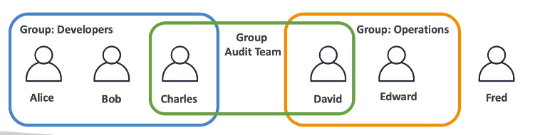
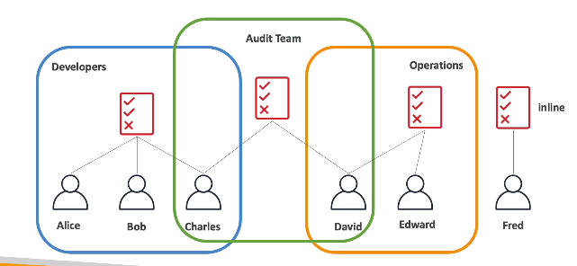

# IAM

## User & Group

- IAM equals Identity and Access Management, Global Service.
- Users are people within your organization, can be grouped.
- User don't have to belong to a group and user can belong to groups.



## Permissions

- User or Groups can be assigned JSON documents called policies.
- These policies define the permissions of the user.

### IAM Policies inheritance



In this image, we can see that: Charles and David inherited 2 permissions (Audit and developers or Operators).

### IAM Policies Structure

Consists of

- `version`: policy language version, always include "2012-10-17".
- `id`: an identity for the policy (optional).
- `Statement`: one or more individual statements (required).

Statement consists of

- `sid`: an identifier for the statement (optional).
- `effect`: whether the statement allows or denies access (Allow, Deny)
- `principal`: account/user/role which this policy applied to

Example:

```json
{
  "version": "2012-10-17",
  "Statement": [
    {
      "Effect": "Allow",
      "Action": "ec2:Describe*",
      "Resource:": "*"
    },
    {
      "Effect": "Allow",
      "Action": "elasticloadbalancing:Describe*",
      "Resource": "*"
    },
    {
      "Effect": "Allow",
      "Action": [
        "cloudwatch:ListMetrics",
        "cloudwatch:GetMetricStatistics",
        "cloudwatch:Describe*"
      ],
      "Resource": "*"
    },
    {
      "Sid": "1",
      "Effect": "Allow",
      "Principal": {
        "AWS": ["arn:aws:iam:123456789:root"]
      }
    }
  ]
}
```

## Important

- Root account created by default, shouldn't be used or shared.

- In `AWS` you apply the `least privilege principle`: don't give more permissions than a user needs.
