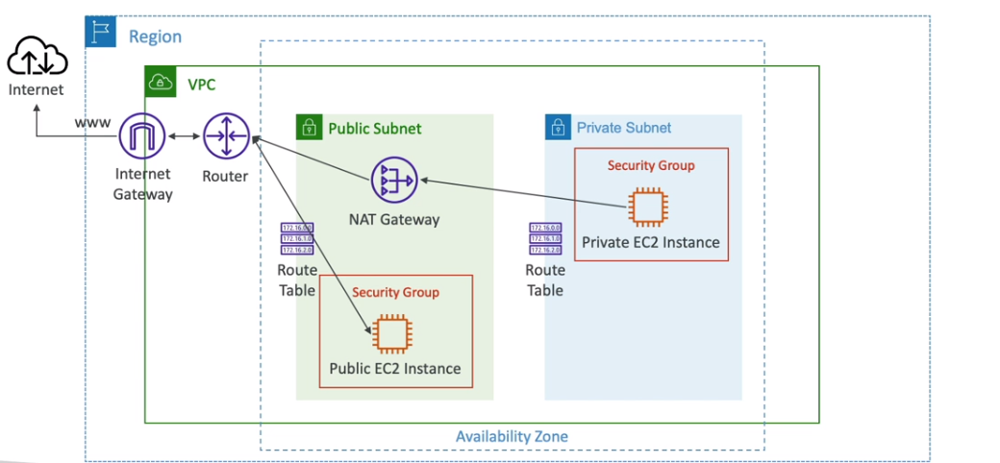
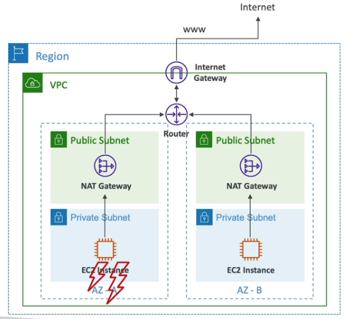
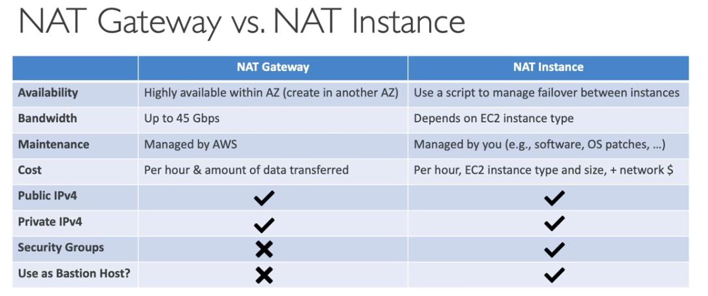

# NAT Instance **outdated**

- NAT = Network Address Translation
- Allow EC2 instances in private subnets to connect to the internet.
- Must be launched in a public subnet.
- Must disable EC2 setting: **Source/destination Check**
- Must have Elastic IP attach to it.
- Route tables must be configured to route traffic from private subnets to the NAT instance.

Notes:

- Pre-configured Amazon Linux AMI is available.
  - Reached the end of standard support on December 31, 2020
- Not highly available / resilient setup out of the box.
  - We need to create an ASG in multiple AZ + resilient user-data script.
- Internet traffic bandwidth depended on EC2 instance type.
- We must manage Security Group & rules:
  - Inbound:
    - Allow HTTP/HTTPS traffic comming from Private Subnets.
    - Allow SSH from your home network (access is provided throw Internet Gateway)
  - Outbound:
    - Allow HTTP/HTTPS traffic to the internet.

# NAT Gateway

- AWS managed NAT, high bandwidth, high availability, no administration
- Pay per hour for usage and bandwidth
- `NATGW` is created in a specific AZ, uses an EIP.
- Can't be used by EC2 instance in the same subnet (only from other subnets).
- Required an IGW (Private Subnet => `NATGW` => IGW). NATGW cannot work without IGW.
- 5 Gbps of bandwidth with automatic scaling up to 45Gbps.
- No security groups to manage, required.

- NATGW is resilient within a single AZ.
- **MUST** create **multiple NAT Gateways** in **multiple AZs** for fault-tolerance.
- No cross-AZ failover needed because if an AZ goes down it doesn't need NAT, all EC2 instances in that AZ will not be accessible. => We don't need to connect the AZs together through the route tables.

## Recommended steps to create new NAT Gateway

- Select multiple subnets for high availability.
- Select an EIP to the `NATGW`.
- Edit the route tables:
  - Create new destination for the `NATGW`, Example: 0.0.0.0/0 -> `NATGW_ID`
- Back to `Bastion Host` instance and launched it. Connect `Bastion Host` to the private instance and try to connect internet from there. Example: `ping www.google.com`
