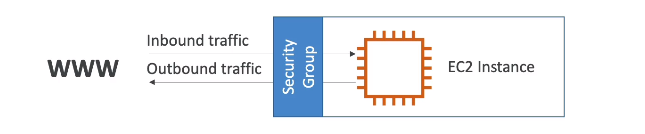
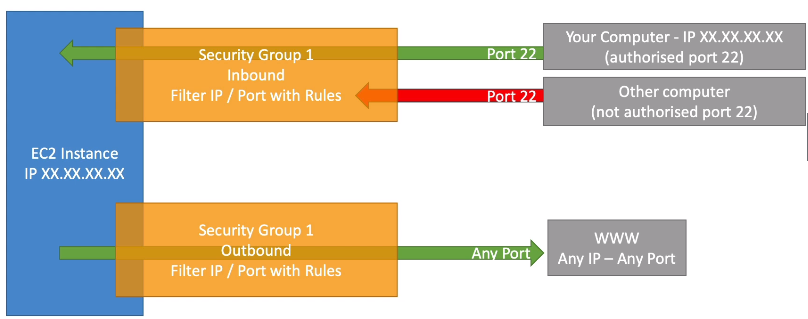
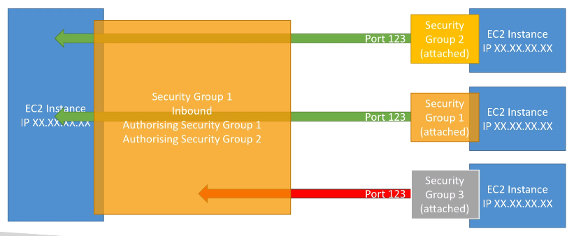

# Security Groups

- Security groups are the fundamental of network security in AWS.
- They control how traffic is allowed into or out of our EC2 instances.
- Security groups contain `allow` rules, without it nothing can be transfered.
- Security groups rules can reference by IP or by security group.

- Security groups are acting like the 'firewall' on `EC2 instances`.
- They regulate:
  - Access to ports.
  - Authorised IP ranges - Ipv4 and Ipv6.
  - Control of inbound network (from the other to the instance)
  - Control of outbound network (from the instance to the other)

## Important

- Security groups can be attached to multiple instances.
- Locked down to a region / VPC combination.
- Does live 'outside' the EC2 - if traffic is blocked the EC2 instance won't see it.
- It's good to maintain one separate security group for SSH access.
- If your application is not accessible (time out), then it's a security group issue.
- If your application gives a 'connection refused' error, then it's an application error or it's not launched.
- All inbound traffic is blocked by default.
- All outbound traffic is authorised by default.

- Some classic ports to know:
  - `22` = SSH (Secure shell) - log into a Linux instance.
  - `21` = FTP (File transfer protocol) - upload files into a file share.
  - `22` = SFTP (Secure file transfer protocol) - upload file using SSH.
  - `80` = HTTP - access unsecured websites.
  - `443` = HTTPS - access secured websites.
  - `3389` = RDP (Remote desktop protocol) - log into windows instance.
