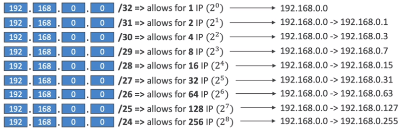

# CIDR - IPV4

- Classless Inter-Domain Routing - a method for allocating IP addresses.
- Used in `Security Groups` rules and AWS networking in general.
- They help to define an IP address range.
- We can define: 192.168.0.0/26 => 192.168.0.0 - 192.168.0.63 (64 IP addresses).

## How CIDR works?

- A CIDR consists of 2 components:
  - `Base IP`: Represents an IP contained in the range (XX.XX.XX.XX). Example: 10.0.0.0, 192.168.0.0,...
  - `Subnet Mask`: Define how many bits can change in the IP. It can be represented as 2 forms (/8 <=> 255.0.0.0, /16 <=> 255.255.0.0,...). Example: /0, /24, /32,...

### Subnet Mask

- The subnet mask basically allows part of the underlying IP to get additional next values from the base IP.

[CIDR Converter](https://www.ipaddressguide.com/cidr) 

## Public versus Private IP

- The Internet Assigned Number Authority (IANA) established certain blocks of IPv4 addresses for the use of private (LAN) and public (Internet) addresses.
- Private IP can only allow certain values:
  - 10.0.0.0 - 10.255.255.255 (10.0.0.0/8) in big networks.
  - 172.16.0.0 - 172.31.255.255 (172.16.0.0/12) AWS default VPC in that range.
  - 192.168.0.0 - 192.168.255.255 (192.168.0.0/16) home networks.
- All the rest of IP addresses on the Internet are Public.
